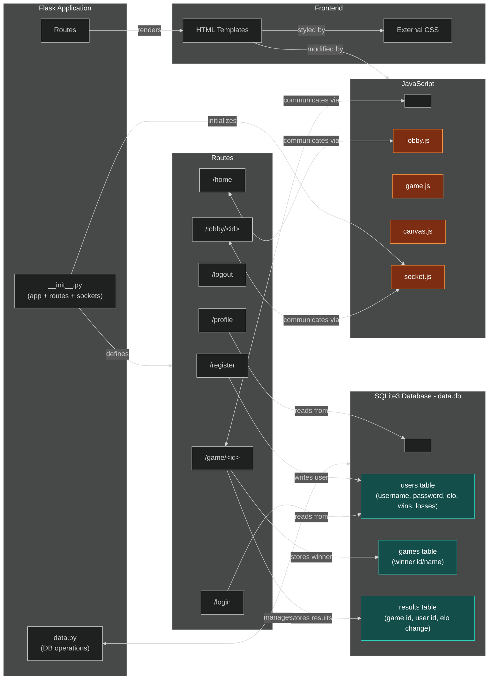
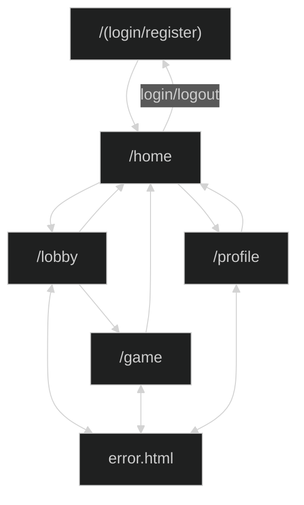

# System Blueprint

## TNPG: PortendedGreatness
## project: Copyrighted Artist
## Target ship date: {2026-06-xx}

---

#### roster:

| Name | Email | Primary Role | Secondary Role |
|---|---|---|---|
|Yuhang Pan|yuhangp@nycstudents.net|Project Manager|Game logic + CSS|
|Andrew Tsai|andrewt194@nycstudents.net|DB Manager|JS|
|Zixi Qiao|zixiq@nycstudents.net|Socket|JS|
|Owen Zeng|owenz20@nycstudents.net|HTML|JS|

---

# Summary
A website hosting a drawing guessing game commonly known as Copyrighted Artists.

## Problem Being Solved
Boredom

## Target Users

- Fun-seekers
- Friend-havers
- Unem*loyed-artists

## Why This Project Matters
It will help alleviate boredom and train discerning eyes for distinguishing between real and fake drawings

# Minimum Viable Product (MVP) Scope
Website with socket lobbies and functioning game

## Core Features (Required for Final Submission)
Features that **must** be completed:
1. Socket Lobbies
2. Working Game
3. Login DB

## Stretch Features (Only if MVP is Complete)
1. Elo System
2. Matchmaking System
3. Game history

## Explicit Non-Goals

Features intentionally excluded:
- Pay to win
- Unfiltered prompts

---

# Technology Stack

| Layer | Selected Tool |
|---|---|
| Backend Framework | Flask |
| Frontend Framework | tailwind |
| Database | SQLite |
| Authentication | Flask sessions |
| ORM / DB Library | none |

## Why This Stack Was Chosen
Flask and SQLite for simplicity since all the devos knows very well on how to use it.  
---

# Team Ownership Plan

Each member must own meaningful deliverables.

| Team Member | Primary Ownership | Secondary Ownership | Specific Deliverables |
|---|---|---|---|
|Yuhang Pan|Project Manager|Flask + Game Logic|Implement different phases of the game + ensure that they work|
|Andrew Tsai|DB Manager|JS Canvas|Designing drawing interface of the game using Canvas and send game data to database|
|Zixi Qiao|Flask Socket|JS Lead|Creating separate lobbies and facilitate displaying updates to users in lobby during the game|
|Owen Zeng|HTML + CSS|JS Sub|Creating base HTML templates to render pages|

---

# Component map

# Site map

## Key User Stories
### eg0
As an aspiring artist, I want to train my ability to emulate art styles so that I can become better at drawing.

### eg1
As a person with many friends, I want to play a party game so that we can all have fun.

### eg2
As a person with no friends, I want to obsessively play a multiplayer game so that I can beat everyone else and prove my own self-worth.

# Database Design
<table>
<tr>
  <th colspan="4"><strong>USERS</strong></th>
</tr>
<tr><td>INTEGER</td><td>id</td><td>PK</td><td>Auto-increment</td></tr>
<tr><td>TEXT</td><td>name</td><td></td><td>Unique</td></tr>
<tr><td>TEXT</td><td>password</td><td></td><td>For authentication</td></tr>
<tr><td>REAL</td><td>elo</td><td></td><td></td></tr>
<tr><td>DATE</td><td>created_at</td><td></td><td></td></tr>
<tr><td>INTEGER</td><td>games_won</td><td></td><td></td></tr>
<tr><td>INTEGER</td><td>games_played</td><td></td><td></td></tr>
<tr><td>INTEGER</td><td>total_placement</td><td></td><td></td></tr>
</table>

<table>
<tr>
  <th colspan="4"><strong>GAMES</strong></th>
</tr>
<tr><td>INTEGER</td><td>id</td><td>PK</td><td>Auto-increment</td></tr>
<tr><td>INTEGER</td><td>winner_id</td><td>FK</td><td>USERS(id)</td></tr>
<tr><td>DATE</td><td>timestamp</td><td></td><td></td></tr>
</table>

<table>
<tr>
  <th colspan="4"><strong>RESULTS</strong></th>
</tr>
<tr><td>INTEGER</td><td>id</td><td>PK</td><td>Auto-increment</td></tr>
<tr><td>INTEGER</td><td>game_id</td><td>FK</td><td>GAMES(id)</td></tr>
<tr><td>INTEGER</td><td>user_id</td><td>FK</td><td>USERS(id)</td></tr>
<tr><td>REAL</td><td>elo_change</td><td></td><td></td></tr>
</table>

# Testing Plan
{Delineate here your plan for testing each component}
- First we will make sure all the routes to the web pages work.
- Create lobbies to test socket connections and test sending images
- Test game logic independently by creating a testable lobby connect all the users to it
- Play through a game and check that user data is updated properly
- Work on extra functions and features  

# Timeline
## Week 1 Goals: Working lobbies + basic site infrastructure
## Week 2 Goals: Game logic completed + database + JS Canvas
## Week 3 Goals: User stats + matchmaking system + profile complete
## Internal Deadlines:
{List milestones your team has identified, in the order they must be completed. Set a target completion date for each.}
- Flask sockets for lobbies by 5/12

# Completion Criteria (_a.k.a._ "Definition of 'Done'")
Project is considered complete when all of the following are true:
1. Socket/lobby system working
2. Game logic + graphics completed
3. User profile data and db secured

# Open Questions
{Delineate anything undecided here}

# Appendix
{Any relevant info that is useful but would have interrupted narrative flow above, or cluttered the information portrayed}

# Other
{Put here anything that did not sensibly fit under above headings. This section will inform evolution of SoftDev.}
