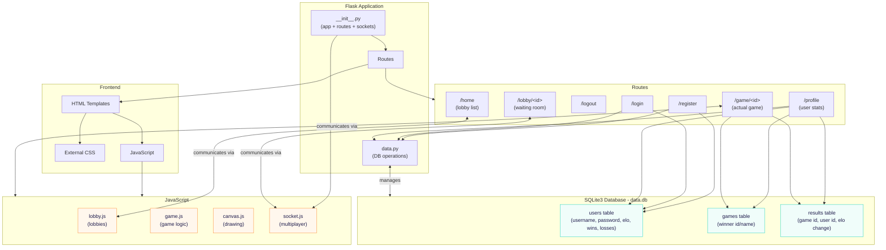
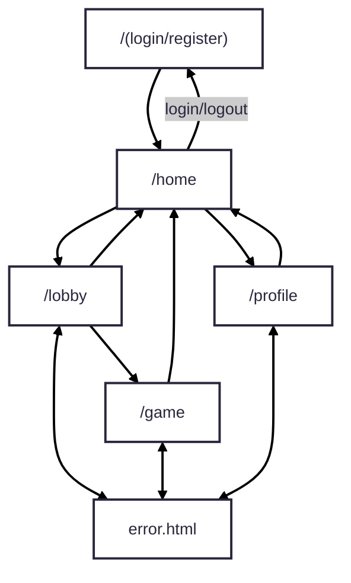

# P05: Le Fin  
## Design Doc by PortendedGreatness, pd. 5  
##### ⤷ Roster: Yuhang Pan (PM), Andrew Tsai, Owen Zeng, Zixi Qiao  
## PROJECT NAME:
Copyrighted Artists  
### DESCRIPTION:
The initial load page will lead you to register an account. Afterwards, you will be redirected to a homepage, from which you can join game lobbies. Upon joining a game lobby, you will be led to a game window where you can draw based on a prompt or based off of what other people have drawn. The site will award you elo points based on winning or losing.  
##### TARGET SHIP DATE: 06-07-2026

### Program Components:
- Flask App (Python)
  - \_\_init\_\_.py (main app + routes)
    - Creates Flask app, config, and session handling
    - Renders templates and connects frontend to backend logic
    - Initialize sockets for multiplayer
    - Routes:
        - /register adds a new user to the users table (data.py). Checks if the username is unique, hashes the password, stores it in session, then redirects to /home.
        - /login checks users (data.py), verifies password hash, stores session, and redirects to /home.
        - /logout clears session, redirects to /login.
        - /home lobby list where users can join or create a lobby
        - /lobby/<id> waiting room for players to fill up to start the game
        - /game/<id> the actual game
        - /profile uses data.py to load a user's stats
  - build_db.py
    - Connects to SQLite3 database and creates/maintains tables
  - game_logic.py
    - Manages the different phases of the game (drawing, voting, etc.)
  - Database (SQLite3) (stored in data.db)
    - users table stores all usernames and password hashes for authentication, and other stats like elo, #wins, #losses, etc.
    - games table stores the winner's id/name to be used for profile page
    - results table stores the a pair of game&user id to keep track of a user's game history like elo change in the game played
- Frontend Framework
  - Tailwind
- JavaScript
  - lobby.js handles the lobbies
  - game.js handles the game stuff
  - canvas.js handles the drawing on js canvas
  - socket.js handles the sockets for multiplayer
- RESTful APIs
  - None

### Component Map:

### Database Organization

<table>
<tr>
  <th colspan="4"><strong>USERS</strong></th>
</tr>
<tr><td>INTEGER</td><td>id</td><td>PK</td><td>Auto-increment</td></tr>
<tr><td>TEXT</td><td>name</td><td></td><td>Unique</td></tr>
<tr><td>TEXT</td><td>password</td><td></td><td>For authentication</td></tr>
<tr><td>REAL</td><td>elo</td><td></td><td></td></tr>
<tr><td>DATE</td><td>created_at</td><td></td><td></td></tr>
<tr><td>INTEGER</td><td>games_won</td><td></td><td></td></tr>
<tr><td>INTEGER</td><td>games_played</td><td></td><td></td></tr>
<tr><td>INTEGER</td><td>total_placement</td><td></td><td></td></tr>
</table>

<table>
<tr>
  <th colspan="4"><strong>GAMES</strong></th>
</tr>
<tr><td>INTEGER</td><td>id</td><td>PK</td><td>Auto-increment</td></tr>
<tr><td>INTEGER</td><td>winner_id</td><td>FK</td><td>USERS(id)</td></tr>
<tr><td>DATE</td><td>timestamp</td><td>PK</td><td></td></tr>
</table>

<table>
<tr>
  <th colspan="4"><strong>RESULTS</strong></th>
</tr>
<tr><td>INTEGER</td><td>id</td><td>PK</td><td>Auto-increment</td></tr>
<tr><td>INTEGER</td><td>game_id</td><td>FK</td><td>GAMES(id)</td></tr>
<tr><td>INTEGER</td><td>user_id</td><td>FK</td><td>USERS(id)</td></tr>
<tr><td>REAL</td><td>elo_change</td><td></td><td></td></tr>
</table>

### Site Map:
- Templates (HTML)
  - (login.html) /login (username + password. Error message if login fails).
  - (register.html) /register (username + password. Error message if username is taken).
  - (home.html) /home (List of lobbies + button for users to create their own)
  - (lobby.html) /lobby/<id> (Waiting room, displays the users in the lobby and button to leave lobby)
  - (game.html) /game/<id> Needs a lot of things:
    - Canvas for drawing
    - Timer for all the phases (drawing, voting)
    - List of players and their current scores
    - Button for voting
  - (profile.html) /profile (shows username, elo, etc.).
  - error.html (invalid id’s or permission errors).

Tasks & Assignments

<table>
<tr>
  <th colspan="4"><strong>TASK BREAKDOWN</strong></th>
</tr>
<tr><td><strong>Task</strong></td><td><strong>Devo</strong></td></tr>
<tr><td>JS & DB stuff</td><td>Andrew Tsai</td></tr>
<tr><td>JS & HTML stuff</td><td>Owen Zeng</td></tr>
<tr><td>JS & SOCKET stuff</td><td>Zixi Qiao</td></tr>
<tr><td>Game Logic and CSS stuff</td><td>Yuhang Pan</td></tr>
</table>
